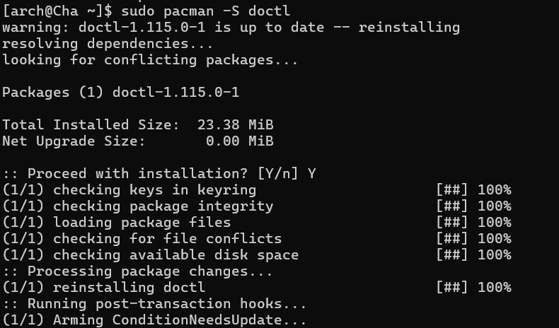
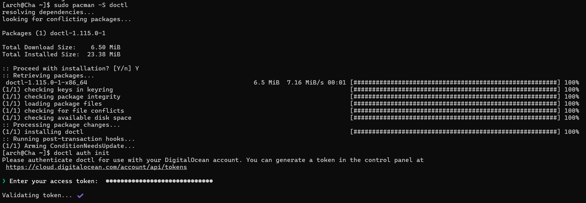
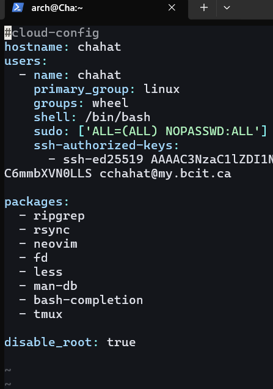
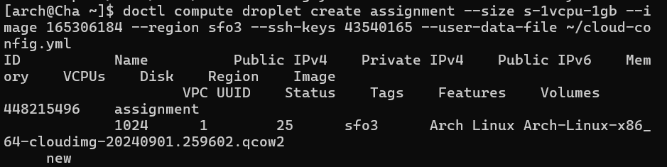

# ACIT 2420 Assignment 1 - Fall 2024

### Learning Objectives:
This tutorial will teach you how to use ‘doctl’ and a cloud-init configuration to setup and operate a remote server on DigitalOcean. You can automate the setup of new droplets with this configuration.

### Prerequisites:
- Existing Arch Linux droplet:  this tutorial will also give a brief about how to create a droplet using DigitalOcean web Console.
- SSH key pair: you need ssh keypair to securely access the droplets.

### Introduction:
In this tutorial, we will be creating a Droplet running Arch Linux using the ‘doctl’ command-line tool. we will use ‘doctl’ and cloud-init for every step of setting up the Arch Linux droplet. We will start by manually setting up an Arch Linux droplet and will automate the process using ‘doctl’ and cloud-init configuration.

### Steps on creating Arch Linux droplet using DigitalOcean web console:

### 1. Generate SSH key pair on your local Machine
Open terminal and run the command below to create SSH key pair:
```
ssh-keygen -t ed25519 -f ~/.ssh/your-key -C “your-email”
```
This will create two keys: 
   - your-key 
   - your-key pub (this is the public key you will use to connect to your DigitalOcean account)
### 2. Add your public key to DigitalOcean:
- Login to your DigitalOcean account 
- In the navigation bar on the left Click Settings -> Security -> SSH keys.
- Paste your public key here (The key you just created)


#### 3. Create an Arch Linux Droplet:
In the DigitalOcean web console:
- Click the **Create** button and select **Droplet**.
- Choose the **Custom Image** tab and upload your Arch Linux image(the “qco” file you downloaded).
- Set the region and data center (e.g., **SFO3**).
- Choose an appropriate CPU option (e.g., **$7 AMD**).
- Under **Authentication**, select **SSH Key** and add the key you uploaded.
- Set a hostname for your droplet (change it to something simple) (e.g., **arch-droplet**).
- Click **Create Droplet** and note the IP address of your new droplet.

#### 4. Connect to Your Droplet via SSH:
Use the command below to connect to your droplet:
```
ssh -i ~/.ssh/your-key username@your-droplet-IPaddress
```

## Level 3 – Creating and Managing droplets using ‘doctl’ and cloud-init
Now you have a running Arch linux machine, you will be creating another droplet in the running Arch linux machine and you will Install and configure `doctl` in an existing droplet(one you have) and use it to create a new droplet.

### 1. Use SSH to get into your existing droplet:
Use the command below:
```
ssh username@your-droplet-IP address
```
Username = the username you gave to your droplet


### 2. Create SSH key pair on your Arch Droplet:
Use the command below:
``` 
ssh-keygen -t ed25519 -C “your-email”
```
Notice that there is not specific path, In Linux it goes to a default location that is “~./.ssh/”
Now copy the content of the key and paste to to your DigitialOcean account as we did before.
To write the content of the public key you use the command below (OpenAI, chatgpt4, 2023):
```
Cat ~/.ssh/id_ed25519.pub
```
### 3. Install ‘doctl’ on your droplet:
'doctl' is a tool provided by DigitalOcean that allows you to manage your digitalOcean resources from the terminal. For example, in this assignment, doctl is used to create a new droplet in the existing droplet.
Use the command below:
```
Sudo pacman -S doctl
```


### 4. Authenticate ‘doctl’ using DigitalOcean API Token:
To link ‘doctl’ with you DigitalOcean account, you authenticate it. First you create API token from your DigitalOcean account (API -> Tokens)
Use the command below to authenticate it:
```
Doctl auth init
```
Enter the token when prompted 



### 5. Create the cloud-config file (cloud-init configuration file):
Cloud-init helps to automate the droplet setup (create users, install packages and disable root access). Use the command below:

```
Vim ~/cloud-config.yml
```
~ = home directory 
Now add the following to the file:

```
#cloud-config
users:
  - name: chahat      # Replace with your username
    primary_group: linux     # Replace with your group
    groups: wheel
    shell: /bin/bash
    sudo: ['ALL=(ALL) NOPASSWD:ALL']
    ssh-authorized-keys:
      - ssh-ed25519 AAA...  # Your public key here

packages:
  - ripgrep
  - rsync
  - neovim
  - fd
  - less
  - man-db
  - bash-completion
  - tmux

disable_root: true
```


### 6. Create a New Droplet using ‘doctl’:

Now, use 'doctl' to create a new droplet with the cloud-init configuration. First, get your SSH key ID and image ID:

- List your SSH keys:
  ```
  doctl compute ssh-key list
  ```
- find the image ID (use the grep command to search for "qco" images):
  ```
  doctl compute image list | grep "qco"
  ```

Create the droplet:
```
doctl compute droplet create "new-droplet-name" \
  --size s-1vcpu-1gb \
  --image "image-id" \
  --region sfo3 \
  --ssh-keys "ssh-key-id" \
  --user-data-file ~/cloud-config.yml
```
We have used size = s-1vcpu-1gb because it is the standard size for the cpu on DigitalOcean.



#### 7. Verify the New Droplet:
To confirm the droplet was created, use:
```
doctl compute droplet list
```
This will display a list of all droplets, including the one you just created.

#### 8. Connect to the New Droplet:
Now that the droplet is created and configured, use SSH to connect to it:
```
ssh your-username@your-new-droplet-ip
```
You can find the droplet's IP address in the DigitalOcean dashboard. Now you should see you new droplet running.


### Conclusion:
In this Assignment, you have:
- Created Arch Linux image using DigitalOcean.
- Created and managed SSH keys.
- Configured cloud-init to automate the droplet setup.
- Used ‘doctl’ to create new droplet and then connect to it via SSH. 

### References:

-	INIT documentation¶. cloud. (n.d.). https://docs.cloud-init.io/en/latest/index.html 
-	How to use cloud-config for your initial server setup. DigitalOcean. (n.d.). https://www.digitalocean.com/community/tutorials/how-to-use-cloud-config-for-your-initial-server-setup 
-	Doctl Command Line Interface (CLI). DigitalOcean Documentation. (n.d.). https://docs.digitalocean.com/reference/doctl/ 
-	OpenAI, chatgpt3,(2023) (mainly for the final proofing and cat command)
-	McNinch, N. (n.d.). 2420-notes/week-three.md · main · cit_2420 / 2420-notes-F24 · GITLAB. GitLab. https://gitlab.com/cit2420/2420-notes-f24/-/blob/main/2420-notes/week-three.md 
-	McNinch, N. (n.d.-b). https://gitlab.com/cit2420/2420-notes-f24/-/blob/main/2420-notes/week-two.md 
-	Markdown guide. Markdown Guide. (n.d.). https://www.markdownguide.org/
